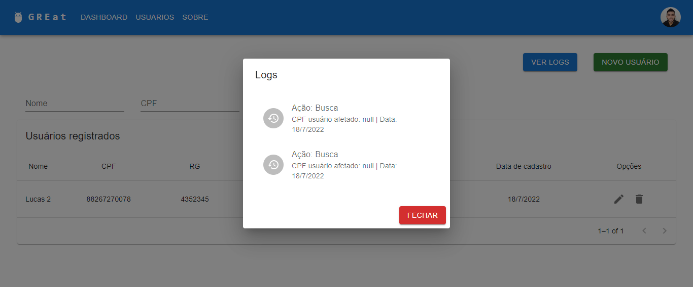

# Desafio-GREat-spring-API

Desafio-GREat-spring-API trata-se de um repositório crado para resolver o desafio proposto pela equipe GREat diante a seleção Programa Cientista Chefe para Bolsa de Inovação Tecnológica. Mediante a este desafio, foram desenvolvidas duas aplicações com as tecnologias mais atuais do mercado de desenvolvimento: Spring boot e React.

