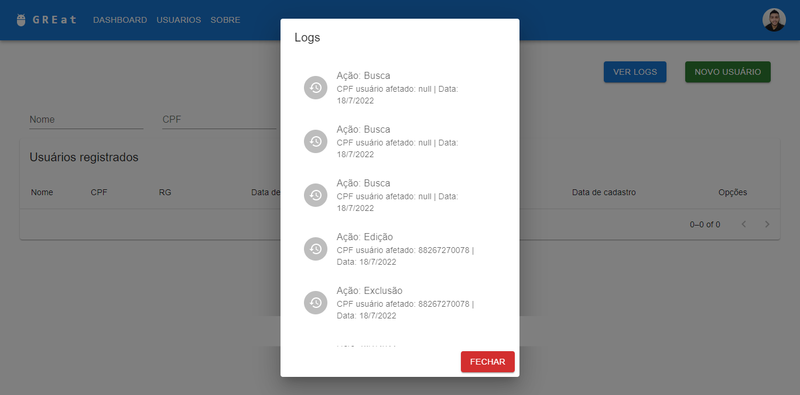
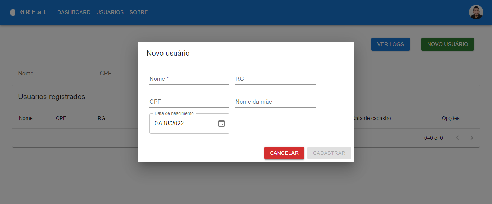
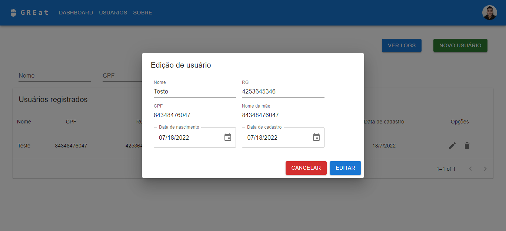

# Desafio-GREat-spring-API


Desafio-GREat-spring-API trata-se de um repositório crado para resolver o desafio proposto pela equipe GREat diante a seleção Programa Cientista Chefe para Bolsa de Inovação Tecnológica. Mediante a este desafio, foram desenvolvidas duas aplicações com as tecnologias mais atuais do mercado de desenvolvimento: Spring boot e React.
<center>
  
</center>


## API:

Podendo ser encontrada na pasta <a href="https://github.com/lucasDSBR/desafio-GREat-spring-API-and-Front/tree/main/spring-API"><b>"spring-API"</b></a>, a API do sistema foi desenvolvida com base no modelo MVC(model view controller) para melhor atender os requisitos do sistema. Além disso, optei por escolher o banco de dados MySQL para armazenar os dados utilizados em todo o sistema.

Configurações de acesso ao DB e porta de execução do sistema:
<b>application.properties</b>
```
spring.datasource.url=jdbc:mysql://localhost:3306/springboot
spring.datasource.username=root
spring.datasource.password=
 
spring.jpa.hibernate.ddl-auto=update
spring.jpa.properties.hibernate.dialect=org.hibernate.dialect.MySQL5InnoDBDialect
server.port=8081
```
Além disso, para evitar erros de CORS, decidi inserir um CrossOrigin nos controllers da aplicação:
```
@CrossOrigin(origins = "http://localhost:3000", maxAge = 3600)
```

#### Tratamento de erros:
Apara melhor segurança no armazenamento de informações, opitei por realizar todo o tratamento de erros com relação a informações erradas na própria API. Logo, a validação de CPF não ocorre no front alí com o usuário, mas sim no Back-End. Assim, evitando o armazenamento de tais informações.
- Segurança ??? O Front-End é passível de modificações, logo, validar uma informação apenas acaba não sendo tão vantajoso.
## FRONT END:
Podendo ser encontrada na pasta <a href="https://github.com/lucasDSBR/desafio-GREat-spring-API-and-Front/tree/main/front"><b>"front"</b></a>, o front-end foi desenvolvido totalmente de React + JS. Além disso, para estilização de toda a aplicação, opitei por utilizar o <a href="https://mui.com/pt/"><b>MUI</b></a>.

### Imagens da aplicação:
#### Tela principal

- A tela principal possui a tela de listagem de usuários + filtro + botôes de logs e registro.


#### Dialog de logs

- O dialog de logs, como já podemos perceber, mostra todas as ações realizadas no sistema anteriormente pelo ususário. Registra em si Buscas, Edições, Exclusões e Registros.



#### Dialog de Registro
- O dialog de registro, como já podemos perceber, é utulizado para realizar o registro de usuários no sistema bastando apenas fornecer as informações de Nome, RG, CPF, Nome da me e Data de nascimento.



#### Dialog de Edição
- O dialog de edição, como já podemos perceber, é utulizado para realizar a edição de usuários no sistema.



